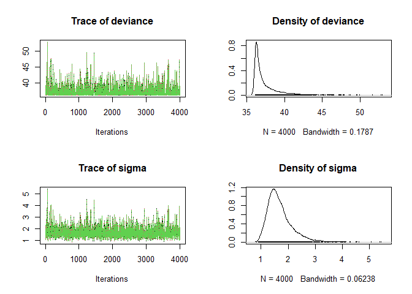
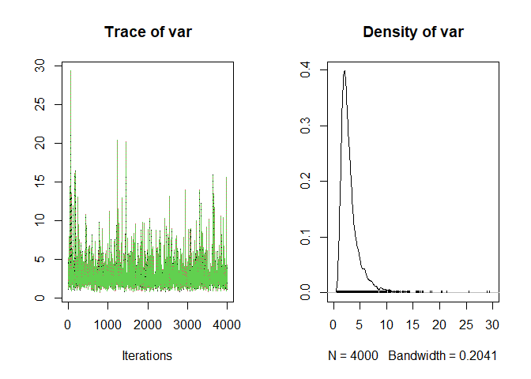

<!-- README.md is generated from README.Rmd. Please edit that file -->

# simanalyse

<!-- badges: start -->

[](https://www.tidyverse.org/lifecycle/#experimental)
[](https://github.com/audrey-b/simanalyse/actions)
[](https://codecov.io/gh/audrey-b/simanalyse?branch=master)
[](https://www.gnu.org/licenses/gpl-3.0.html)
[](https://cran.r-project.org/package=simanalyse)

<!-- badges: end -->

simanalyse is an R package to facilitate model comparisons and
simulation studies.

To install the latest development version from
[GitHub](https://github.com/audrey-b/simanalyse)

``` r
#install.packages("remotes")
remotes::install_github("audrey-b/simanalyse")
```

## Demonstration

### Simulate the Datasets

Simulate 100 datasets using the sims package.

``` r
library(simanalyse)
set.seed(10L)
params <- list(sigma = 2)
constants <- list(mu = 0)
code <- "for(i in 1:10){
          y[i] ~ dnorm(mu, 1/sigma^2)}"
sims <- sims::sims_simulate(code, 
                            parameters = params, 
                            constants = constants,
                            nsims = 100,
                            silent = TRUE)
```

For example, the first dataset is

``` r
sims[1]
#> $y
#>  [1]  1.50009615 -1.04870803 -0.09224249 -1.55116546 -1.26316050  2.48549233
#>  [7]  0.42241980  2.70828118  0.21842600 -0.78109651
#> 
#> $mu
#> [1] 0
#> 
#> an nlists object of an nlist object with 2 numeric elements
```

### Analyse the Datasets

Conduct a Bayesian analysis of each dataset. Let’s analyze each dataset
in “report” mode. By default, this mode runs 3 chains until the
following two criteria are met: convergence based on r.hat &lt;1.1 and a
minimum effective sample size of 400. The first half of the chains is
discarded as burnin. Chains are thinned to 4000 iterations each to
preserve disk and memory usage. See ?sma\_set\_mode for other choices of
modes and customization.

``` r
prior <- "sigma ~ dunif(0, 6)"
results <- sma_analyse(sims = sims,
                       code = code,
                       code.add = prior,
                       mode = sma_set_mode("report"))
```

For example, the posterior distribution obtained from the analysis of
the first dataset is pictured below.

``` r
plot(results[[1]])
```



### Derive New Parameters (if required)

Derive posterior samples for new parameters.

``` r
results.derived <- sma_derive(results, "var=sigma^2", monitor="var")
```

For example, the derived posterior distribution obtained for the first
dataset is pictured below.

``` r
plot(results.derived[[1]])
```

 The
same transformation must be applied to the true parameter values for
eventually evaluating the performance (e.g. bias) of the method for
those new parameters,

``` r
params.derived <- sma_derive(params, "var=sigma^2", monitor="var")
print(params.derived)
#> $var
#> [1] 4
#> 
#> an nlist object with 1 numeric element
```

### Summarise the Results of the Simulation Study

Evaluate the performance of the model using the 100 analyses:

``` r
sma_evaluate(results.derived, parameters=params.derived)
#>   term    bias cpQuantile      mse
#> 1  var 1.76198       0.92 9.410909
```

Several more performance measures are available and can be specified
using the *measures* argument (see ?sma\_evaluate for details). You may
also create custom performance measures. The example below shows how to
reproduce the results above with custom code.

``` r
sma_evaluate(results.derived,
             measures = "", 
             parameters = params.derived, 
             custom_funs = list(estimator = mean,
                                cp.low = function(x) quantile(x, 0.025),
                                cp.upp = function(x) quantile(x, 0.975)),
             custom_expr_b = "bias = estimator - parameters
                              mse = (estimator - parameters)^2
                              cpQuantile = ifelse((parameters >= cp.low) & (parameters <= cp.upp), 1, 0)")
#>   term    bias cpQuantile      mse
#> 1  var 1.76198       0.92 9.410909
```

## Saving to Files

When running lengthy simulation studies, it is often preferable to save
all the results to disk. You may do this by using the functions ending
in *files*. By default, results are saved in your working directory
unless the *path* argument is specified.

``` r
set.seed(10L)
sims::sims_simulate(code, 
                    parameters = params, 
                    constants = constants,
                    nsims = 100,
                    save = TRUE,
                    exists = NA)

sma_analyse_files(code = code,
                  code.add = prior,
                  mode = sma_set_mode("report"))

sma_derive_files(code="var=sigma^2", monitor="var")

sma_evaluate_files()
```

You may read specific files using the function *sma\_read\_files*. For
example,

``` r
sma_read_files(sma_evaluate_files)
#>   term    bias cpQuantile      mse
#> 1  var 1.76198       0.92 9.410909
```

Note that this result is identical to the result we obtained without
saving to files, using the same seed. The result is also identical when
using parallelization, described below.

## Parallelization

Parallelization is achieved using the
[future](https://github.com/HenrikBengtsson/future) package.

To use all available cores on the local machine simply execute the
following code before calling any of the package’s functions.

``` r
library(future)
plan(multisession)
```

## Contribution

Please report any
[issues](https://github.com/audrey-b/simanalyse/issues).

[Pull requests](https://github.com/audrey-b/simanalyse/pulls) are always
welcome.

## Code of Conduct

Please note that the simanalyse project is released with a [Contributor
Code of
Conduct](https://contributor-covenant.org/version/2/0/CODE_OF_CONDUCT.html).
By contributing to this project, you agree to abide by its terms.
